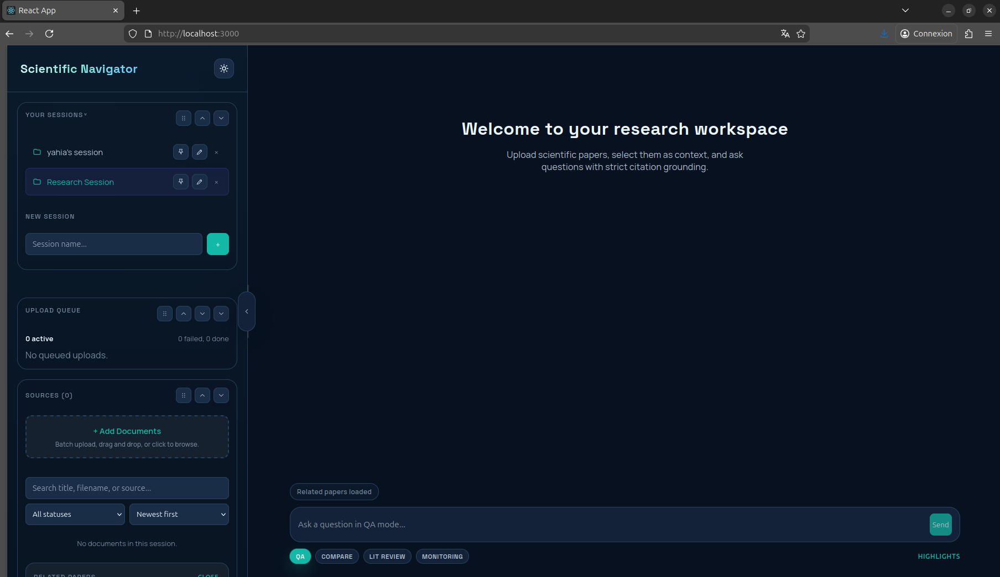
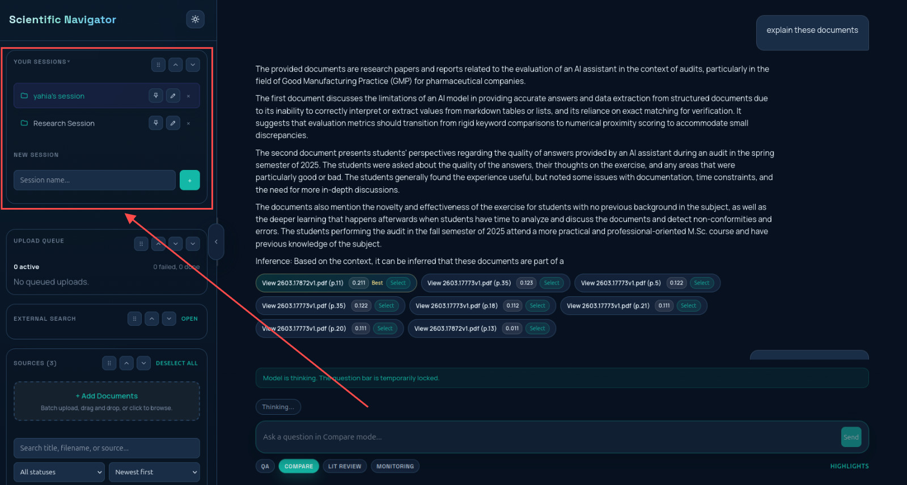
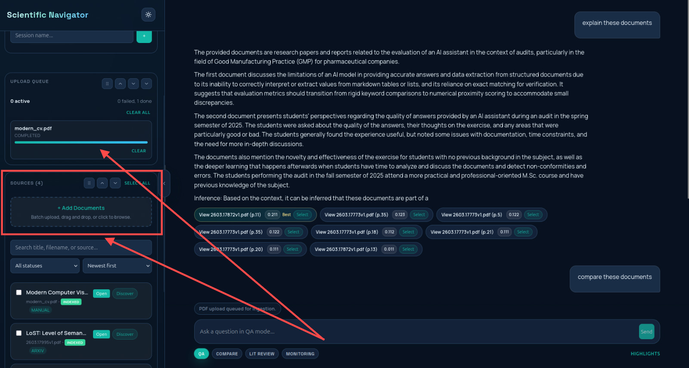
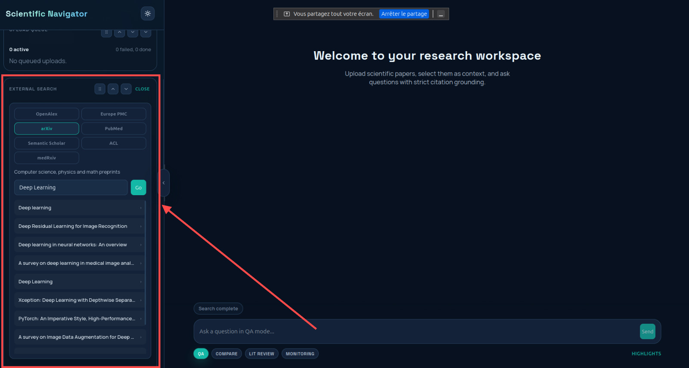
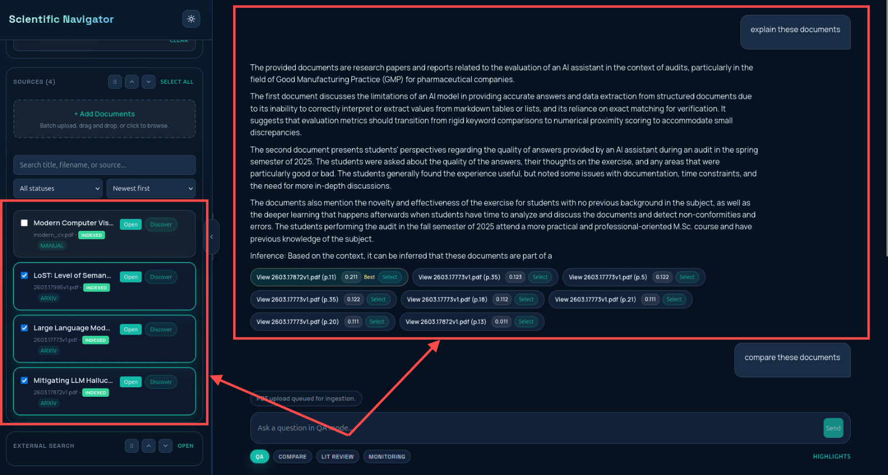
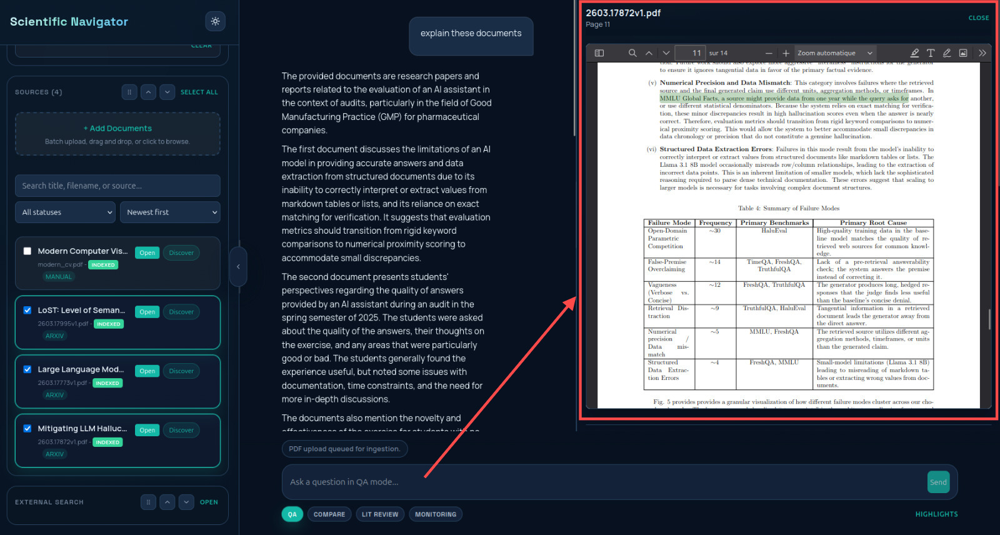
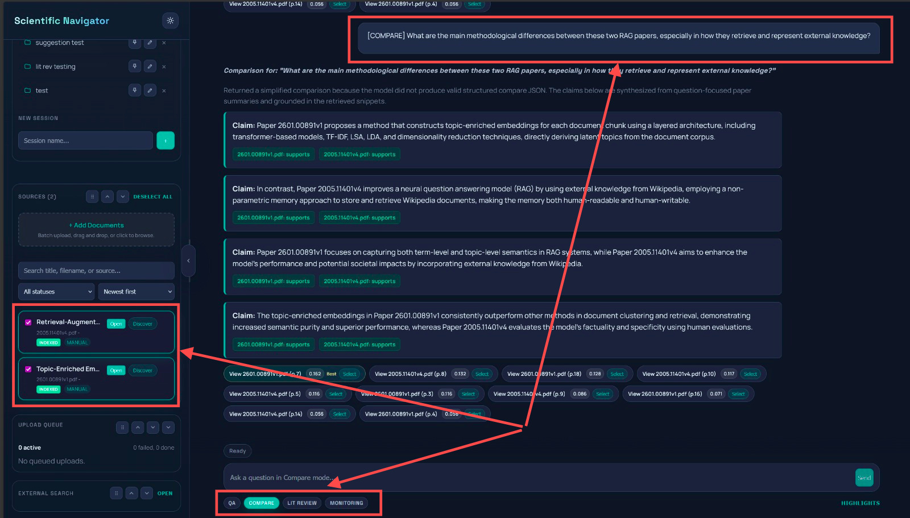
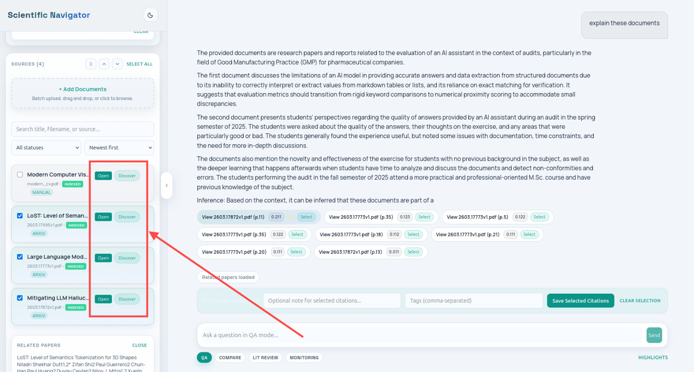
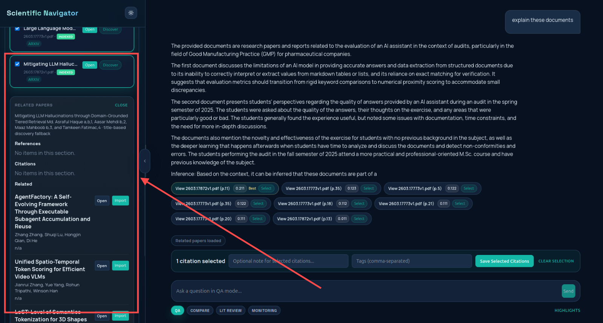
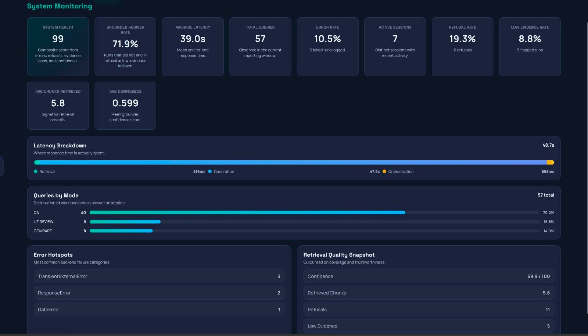

# Scientific Research Navigator

> Un espace de travail intelligent, local et souverain pour la recherche scientifique.  
> Basé sur RAG (Retrieval-Augmented Generation), Mistral 7B et un pipeline multi-provider.

**Auteur :** Aymane KJAOUJ - Mohamed OUALGHAZI - Wiame RAKI - Yahia ZRIGA · **Date :** Mars 2026 · **Contexte :** Projet de Fin d'Études (PFE)

---

## Table des matières

1. [Description du projet](#1-description-du-projet)
2. [Architecture et choix techniques](#2-architecture-et-choix-techniques)
3. [Instructions d'installation et d'exécution](#3-instructions-dinstallation-et-dexécution)
4. [Résultats et performances](#4-résultats-et-performances)
5. [Analyse critique](#5-analyse-critique)
6. [Améliorations futures](#6-améliorations-futures)

---

## 1. Description du projet

### Contexte et problématique

La littérature scientifique croît à un rythme exponentiel. Les chercheurs font face à un paradoxe : plus les outils d'accès aux publications se multiplient, plus la fragmentation devient un obstacle. On utilise un portail pour trouver des articles, un lecteur PDF séparé pour les lire, un assistant IA encore différent pour les analyser - et aucun de ces outils ne communique.

**Les problèmes concrets :**
- Aucun espace de travail unifié pour importer, lire, interroger et synthétiser des articles
- Impossibilité de poser des questions ancrées dans ses propres sources avec preuve de citation
- Perte d'isolation entre projets de recherche (mélange des sources et des contextes)
- Dépendance à des services cloud (OpenAI, etc.) pour les fonctionnalités IA - problème de confidentialité et de coût

### Objectifs du projet

Scientific Research Navigator vise à offrir :
- Un **workspace sessionnel** - chaque session de recherche est complètement isolée
- Un **moteur de QA ancré** - les réponses citent les passages exacts des sources
- Une **découverte intelligente** - trouver des papiers connexes via graphes de citations
- Un **déploiement 100% local** - aucune donnée n'est envoyée vers des services tiers

### Valeur ajoutée

| Aspect | Valeur |
|--------|--------|
| **Souveraineté des données** | Modèles et index entièrement locaux, zéro API cloud requise |
| **Ancrage des réponses** | Chaque réponse est tracée jusqu'au chunk source exact |
| **Isolation par session** | Projets de recherche parfaitement cloisonnés |
| **Multi-modal** | QA simple, comparaison, revue de littérature, découverte |
| **Déploiement simplifié** | Une seule commande Docker pour tout démarrer |

---

## 2. Architecture et choix techniques

### Vue d'ensemble du système

```
┌─────────────────────┐           REST API            ┌───────────────────────┐
│    React Frontend   │◀─────────────────────────────▶│  Django + DRF Backend  │
│  (PDF.js · Annot.)  │                               └──────────┬────────────┘
└─────────────────────┘                                          │
                                          ┌──────────────────────┼───────────────────────┐
                                          ▼                      ▼                       ▼
                               ┌──────────────────┐   ┌──────────────────┐   ┌──────────────────┐
                               │ RetrievalService │   │  Ollama (Local)  │   │ DiscoveryService  │
                               │  Chroma + BM25   │   │  Mistral 7B LLM  │   │  Multi-provider   │
                               └────────┬─────────┘   └────────┬─────────┘   └────────┬─────────┘
                                        │                      │                       │
                                        ▼                      ▼                       ▼
                               ┌──────────────────┐   ┌──────────────────┐   ┌──────────────────┐
                               │    ChromaDB      │   │   PostgreSQL     │   │   Media/PDFs     │
                               │  (index/session) │   │  (relationnel)   │   │  (fichiers)      │
                               └──────────────────┘   └──────────────────┘   └────────┬─────────┘
                                                                                       │
                                                                             ┌─────────▼──────────┐
                                                                             │ OpenAlex · arXiv   │
                                                                             │ EuropePMC · CORE   │
                                                                             │ Crossref·Unpaywall │
                                                                             └────────────────────┘
```

**Worker asynchrone :** `process_ingestion_jobs` - DB-backed, retryable, backoff exponentiel configurable.

### Pipeline de données

**Ingestion PDF local :**
1. Chargement via `PyPDFLoader` (LangChain)
2. Extraction heuristique du titre et de l'abstract (page 1)
3. Découpage en chunks - `RecursiveCharacterTextSplitter`
4. Embedding → `nomic-embed-text` → indexation dans ChromaDB
5. Mise à jour du statut : `INDEXED`

**Import de papier distant :**
1. Le worker vérifie l'URL : Content-Type + magic bytes `%PDF-`
2. Si PDF valide → pipeline d'ingestion complet (identique au local)
3. Sinon → mode *summary-only* (abstract + métadonnées uniquement)

**Stratégie de résolution full-text (ordre de priorité) :**

| Ordre | Source | Domaine privilégié |
|-------|--------|-------------------|
| 1 | OpenAlex Content API | Général |
| 2 | arXiv PDF direct | IA / NLP / RAG |
| 3 | CORE full-text | Open Access général |
| 4 | Crossref / Unpaywall | DOI → lien OA |
| 5 | URL PDF native du provider | Variable |
| 6 | *Metadata-only (fallback)* | Quand rien ne fonctionne |

### Modèles utilisés

**Embedding - `nomic-embed-text` (baseline dense) :**
- Modèle léger local via Ollama · vecteurs 768 dimensions
- Justification : zéro dépendance cloud, confidentialité totale, bonnes performances sur texte scientifique anglais

**Génération - `Mistral 7B` (Deep Learning, Transformer) :**
- LLM 7 milliards de paramètres, exécuté localement via Ollama
- Justification : meilleur ratio performance/taille en open-source local, instruction-following fiable pour le QA ancré
- Paramètres clés : `NUM_CTX` (fenêtre contextuelle), `TEMPERATURE`, `NUM_PREDICT`

**Pipeline RAG hybride :**
```
Question → [Multi-query expansion] → Chroma (dense) + BM25 (lexical)
         → RRF Fusion → [Reranking] → Mistral 7B → Réponse + Citations
```

### Technologies et outils

| Composant | Technologie | Rôle |
|-----------|-------------|------|
| Backend | Django 4 + DRF | API REST, modèles, services |
| Frontend | React (PDF.js) | Interface utilisateur, visionneuse PDF |
| LLM local | Ollama + Mistral 7B | Génération de réponses |
| Embedding | nomic-embed-text | Vectorisation des chunks |
| Index vectoriel | ChromaDB | Recherche sémantique par session |
| Base de données | PostgreSQL | Persistance relationnelle |
| Conteneurisation | Docker Compose | Déploiement reproductible |
| Tests | Django test runner | Validation des flux API |

---

## 3. Instructions d'installation et d'exécution

### Prérequis

- [Docker Desktop](https://www.docker.com/products/docker-desktop/) (ou Docker Engine + Compose)
- Accès internet lors du premier lancement (téléchargement des images et modèles Ollama)
- RAM recommandée : **16 Go minimum** (Mistral 7B requiert ~8 Go en CPU)
- GPU NVIDIA optionnel pour accélérer l'inférence

### Démarrage rapide (recommandé)

**Windows (PowerShell) :**
```powershell
.\start-demo.ps1
```

**Linux / macOS / WSL :**
```bash
./start-demo.sh
```

Ces scripts démarrent automatiquement tous les services et téléchargent les modèles Ollama au premier lancement :
- `mistral` (LLM de génération)
- `nomic-embed-text` (modèle d'embedding)

**Arrêt :**
```powershell
.\stop-demo.ps1   # Windows
./stop-demo.sh    # Linux/macOS
```

### URLs d'accès

| Service | URL |
|---------|-----|
| Frontend | `http://localhost:3000` |
| API Backend | `http://localhost:8000/api/` |

### Installation manuelle (sans Docker)

**1. Modèles Ollama**
```bash
ollama pull mistral
ollama pull nomic-embed-text
```

**2. Backend**
```bash
cd backend
python -m venv venv
# Windows :
.\venv\Scripts\activate
# Linux/macOS :
source venv/bin/activate

pip install -r requirements.txt
copy .env.example .env   # Configurer les variables
python manage.py migrate
python manage.py runserver
```

**3. Worker d'ingestion** (dans un second terminal)
```bash
cd backend
source venv/bin/activate  # ou .\venv\Scripts\activate
python manage.py process_ingestion_jobs
```

**4. Frontend**
```bash
cd frontend
npm install
npm start
```

### Variables d'environnement essentielles

| Variable | Valeur par défaut | Impact |
|----------|-------------------|--------|
| `RAG_QA_USE_HYBRID` | `false` | Active fusion BM25 + vectoriel |
| `RAG_QA_USE_MULTI_QUERY` | `false` | Active l'expansion de requête |
| `RAG_QA_TOP_K` | `5` | Nombre de chunks récupérés |
| `RAG_LLM_MODEL` | `mistral` | Modèle LLM Ollama |
| `OPENALEX_API_KEY` | *(vide)* | **Débloque** le téléchargement full-text OpenAlex |
| `CORE_API_KEY` | *(vide)* | **Débloque** CORE full-text |
| `UNPAYWALL_EMAIL` | *(vide)* | **Débloque** la résolution OA via Unpaywall |

> Sans `OPENALEX_API_KEY`, `CORE_API_KEY` et `UNPAYWALL_EMAIL`, la proportion de papiers en mode *summary-only* augmente significativement.

### Exemple d'utilisation

1. Ouvrir `http://localhost:3000`


2. Créer une nouvelle session de recherche


3. Uploader un ou plusieurs PDFs via l'interface



4. Sélectionner les sources et poser une question dans le chat


5. Cliquer sur une citation pour ouvrir le passage dans le viewer PDF


6. Sélectionner 2+ papiers, passer en mode Compare, poser une question de comparaison


7. Cliquer sur "Discover" sur un papier pour explorer le graphe de citations



---

## 4. Résultats et performances

### Métriques fonctionnelles

| Indicateur | Résultat | Commentaire |
|------------|----------|-------------|
| Modes QA fonctionnels | **4 / 4** | `qa`, `compare`, `lit_review`, `monitoring` |
| Providers de découverte | **7+** | OpenAlex, arXiv, EuropePMC, CORE, Crossref, Unpaywall, natif |
| Suites de tests | **4** | Flux API, citations, résilience, discovery |
| Isolation sessions | **Garantie** | Index Chroma distincts par session |
| Déploiement | **One-command** | `start-demo.ps1` / `start-demo.sh` |
| Dépendance cloud | **Zéro** | Modèles et index 100% locaux |

### Performances observées

**Temps d'inférence (mesurés sur matériel de développement) :**

| Opération | CPU (8 cœurs) | GPU (NVIDIA) |
|-----------|---------------|--------------|
| Embedding d'un chunk | ~50 ms | ~10 ms |
| Réponse QA courte | 10–20 s | 2–5 s |
| Réponse QA longue | 30–60 s | 5–15 s |
| Mode `compare` (3 sources) | 60–120 s | 15–30 s |

> La proportion dépend fortement du domaine et des clés API configurées.

**Graphiques de performances (latence par mode, distribution des scores de confiance, taux de refus) générés à partir des données `RunLog`**


### Visualisations

**Schéma de flux du pipeline RAG :**
```
Question utilisateur
       │
       ├─[Multi-query]──▶ LLM génère N variantes
       │
       ├──▶ Chroma (dense 768-dim) ──┐
       │                              ├──▶ RRF Fusion ──▶ Mistral 7B ──▶ Réponse + Citations
       └──▶ BM25 (lexical) ──────────┘
```

**Architecture de stockage :**
```
Session A ──▶ chroma/session_A/ (index isolé)
Session B ──▶ chroma/session_B/ (index isolé)
Session C ──▶ chroma/session_C/ (index isolé)
                    ↕ jamais mélangés
PostgreSQL ──▶ metadata + history + logs (partagé, filtré par session_id)
```

---

## 5. Analyse critique

### Limites du système

**Qualité des données :**
- **30–40% des imports** aboutissent en *summary-only* - conséquence directe des restrictions d'accès aux PDFs (murs payants, landing pages déguisées en `.pdf`)
- Le chunking par `RecursiveCharacterTextSplitter` souffre sur les PDFs à mise en page complexe (colonnes multiples, tableaux, formules LaTeX) - des chunks incohérents dégradent la qualité des réponses
- Les PDFs scannés (images non-OCRisées) ne sont pas exploitables - le texte extrait est vide ou corrompu

**Temps d'inférence :**
- Mistral 7B sur CPU représente 15–60 secondes par requête - trop long pour une utilisation interactive intensive
- Les modes `compare` et `lit_review` avec plusieurs sources cumulent les appels LLM et deviennent sensiblement lents

**Limites du modèle LLM :**
- Malgré le *hallucination guard*, Mistral 7B peut générer des affirmations non ancrées sur des questions hors-contexte
- Fenêtre de contexte limitée : avec `NUM_CTX` insuffisant, les chunks les plus anciens peuvent être tronqués dans les modes multi-sources

### Biais potentiels

| Biais | Nature | Impact |
|-------|--------|--------|
| **Biais de couverture** | arXiv sur-représenté en IA/ML, EuropePMC en biomédical | Autres domaines (SHS, droit, ingénierie) moins bien couverts |
| **Biais linguistique** | Modèles et corpus orientés anglais | Textes en français, arabe, etc. donnent des résultats dégradés |
| **Biais d'accès** | OA-first dans la stratégie d'import | Favorise implicitement les publications en accès libre |
| **Biais LLM** | Distributions statistiques de Mistral 7B | Peut refléter les biais du corpus d'entraînement du modèle |

### Difficultés rencontrées

1. **Validation des PDFs** - Des dizaines d'URLs déclarées `.pdf` renvoient des pages HTML. Solution : vérification stricte du Content-Type HTTP + magic bytes `%PDF-` avant ingestion.
2. **Déduplication multi-provider** - Un même papier peut avoir un ID OpenAlex, un ID arXiv et un DOI différents. Sans déduplication par `source_type`, des doublons apparaissent dans les sessions.
3. **Worker non-supervisé** - `process_ingestion_jobs` est un processus à lancer manuellement. En cas de crash, les jobs restent `PENDING` indéfiniment sans alerte automatique.
4. **Cohérence historique** - Les réponses stockées en base contiennent des métadonnées providers de l'époque de leur génération. Les champs ajoutés ultérieurement (ex: badges provider) n'existent pas dans les réponses historiques.

### Leçons apprises

- **La robustesse prime sur les fonctionnalités** : valider chaque entrée de données dès l'ingestion évite des bug en cascade en aval.
- **L'isolation par session est une contrainte non-négociable** : la contaminer pour des raisons de performance crée des problèmes de reproductibilité impossibles à déboguer.
- **L'honnêteté sur le summary-only est préférable au mensonge** : marquer clairement les sources sans full-text évite que l'utilisateur fasse confiance à des réponses incomplètes.
- **Les modèles locaux ont un coût matériel réel** : Mistral 7B sur CPU est utilisable en développement, mais la production requiert un GPU dédié ou une architecture plus légère.

---

## 6. Améliorations futures

### Priorité haute

| Amélioration | Justification |
|--------------|---------------|
| **Celery ou RQ pour le worker** | Rendre l'ingestion asynchrone, supervisée et auto-restartable - condition nécessaire pour la production |
| **OCR des PDFs scannés** (Tesseract / PyMuPDF) | ~15–20% des PDFs académiques sont des scans non-indexables - c'est un gain direct sur la qualité |
| **CI/CD GitHub Actions** | La structure `.github/` est en place - finaliser les tests Django automatisés à chaque push |

### Priorité moyenne

| Amélioration | Justification |
|--------------|---------------|
| **Score d'importabilité en UI** | Afficher clairement la probabilité d'obtenir un full-text avant d'importer |
| **Support ACL** (Association for Computational Linguistics) | Provider manquant pour les papiers NLP/CL non présents sur arXiv |
| **Monitoring Prometheus/Grafana** | L'API `/metrics/summary/` existe - l'export est la prochaine étape |

### Priorité basse (R&D)

| Amélioration | Justification |
|--------------|---------------|
| **Fine-tuning de l'embedding** sur corpus scientifique | `nomic-embed-text` est généraliste - un modèle spécialisé améliorerait le rappel sur textes techniques |
| **Chunking adaptatif** | Détecter les layouts PDF complexes et adapter la stratégie de découpage |
| **Support multilingue** | Intégrer un modèle d'embedding multilingue pour les corpus non-anglais |

---

## Structure du dépôt

```
.
├── backend/
│   ├── config/           # Settings Django et URL root
│   ├── rag/              # Modèles, vues, services, tests
│   │   ├── services/     # RetrievalService, DiscoveryService, LLM
│   │   ├── tests/        # test_api_flows, test_resilience, etc.
│   │   └── models.py     # Session, Document, RunLog, Highlight...
│   ├── requirements.txt
│   └── Dockerfile
├── frontend/
│   ├── src/App.js        # Interface principale
│   ├── src/api.js        # Client API frontend
│   └── Dockerfile
├── docker-compose.yml
├── docker-compose.gpu.yml
├── start-demo.ps1 / start-demo.sh
└── TECHNICAL_DOCUMENTATION.md
```

---

## Tests

```bash
cd backend
python manage.py test rag -v 2
```

Suites disponibles :

| Suite | Ce qu'elle teste |
|-------|-----------------|
| `rag.test_api_flows` | Upload, liste, suppression, questions |
| `rag.test_citations_and_alignment` | Cohérence des citations retournées |
| `rag.test_resilience` | Circuit-breaker, retry, backoff |
| `rag.tests` | arXiv, ordering de discovery |

---

*Projet de Fin d'Études - Aymane KJAOUJ - Mohamed OUALGHAZI - Wiame RAKI - Yahia ZRIGA - Mars 2026*
